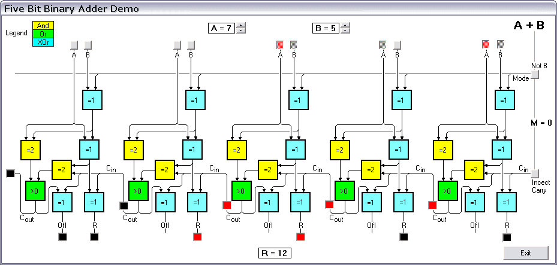



## Binary Adder Demo

### Description

My son and I made this for his IT class. You set or reset the operands bits, the mode, and the injected carry; the binary result, the intermediate and final carry and the overflow bit are then computed and displayed by applying the actual logic in the diagram. Download 8 kB
 
### More Info
 

             |
---                |---
**Submitted On**   |2004-09-18 06:47:02
**By**             |[ULLI](https://github.com/Planet-Source-Code/PSCIndex/blob/master/ByAuthor/ulli.md)
**Level**          |Beginner
**User Rating**    |5.0 (40 globes from 8 users)
**Compatibility**  |VB 6\.0
**Category**       |[Graphics](https://github.com/Planet-Source-Code/PSCIndex/blob/master/ByCategory/graphics__1-46.md)
**World**          |[Visual Basic](https://github.com/Planet-Source-Code/PSCIndex/blob/master/ByWorld/visual-basic.md)
**Archive File**   |[Binary\_Add1795319182004\.zip](https://github.com/Planet-Source-Code/ulli-binary-adder-demo__1-56245/archive/master.zip)

